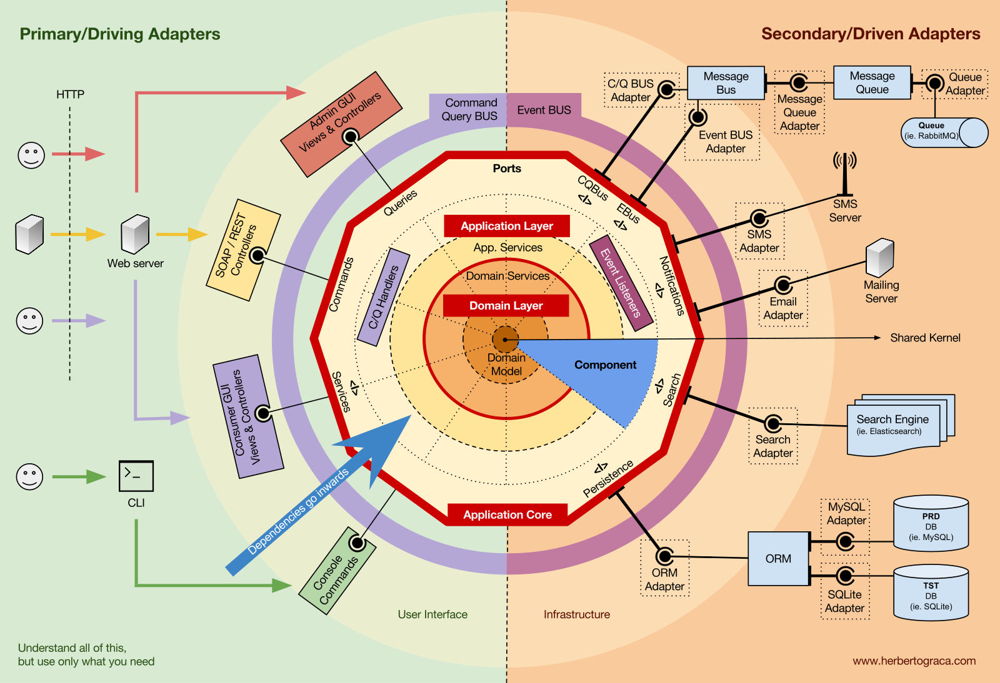

# 개요

보일러 플레이트 프로젝트 구조를 설명하는 문서입니다.

# 1. 패키지 구조

패키지는 크게 도메인으로 나눕니다. 도메인 하나를 앞으로 언제든 분리될 수 있는 서비스 하나로 바라봅니다.  

Hexagonal Architecture는 엄격한 분리에는 좋지만, 서비스 하나를 작성하기 위해 작업해야 할 양이 너무 많습니다. 따라서 Clean Architecture를 따릅니다.  

헥사고날 아키텍처

클린 아키텍처

간단히 구조를 소개하자면 다음과 같습니다.  

* 엔티티
  * High-Order Component입니다. 세부사항으로부터 보호받아야 할 Business 로직과 룰이 위치하는 곳입니다. 
  * 그 어떤 곳에도 의존하지 않습니다. 따라서 그림의 화살표를 보면 의존의 방향이 엔티티를 향하는 것을 볼 수 있습니다.  
* 유스 케이스
  * 비즈니스 룰을 사용하기 위해 노출된 계층으로 보면 쉽습니다.
  * 엔티티로 흐르는 데이터 오케스트레이션 계층.  
* 인터페이스 어댑터
  * 외부의 세부 사항을 유스케이스와 엔티티를 위한 데이터로 변환하는 계층  
* 프레임워크 & 드라이버
  * 세부사항에 직접 닿아 있는 계층
  * HTTP 서버, DB, 프레임워크 등

